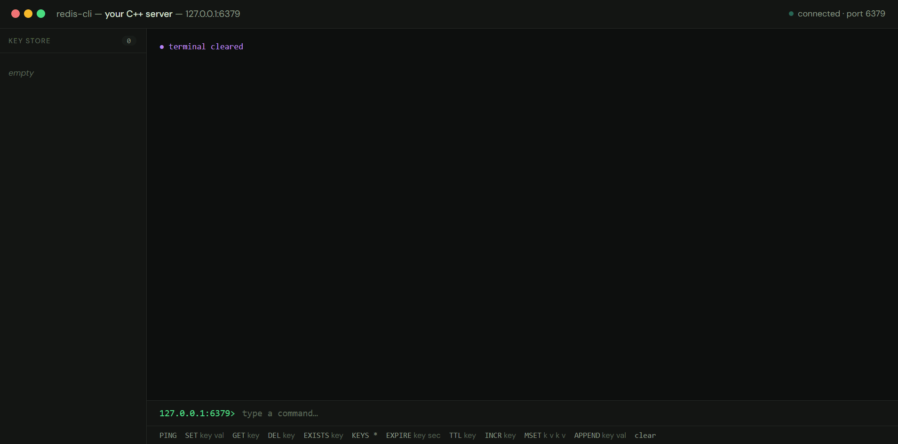
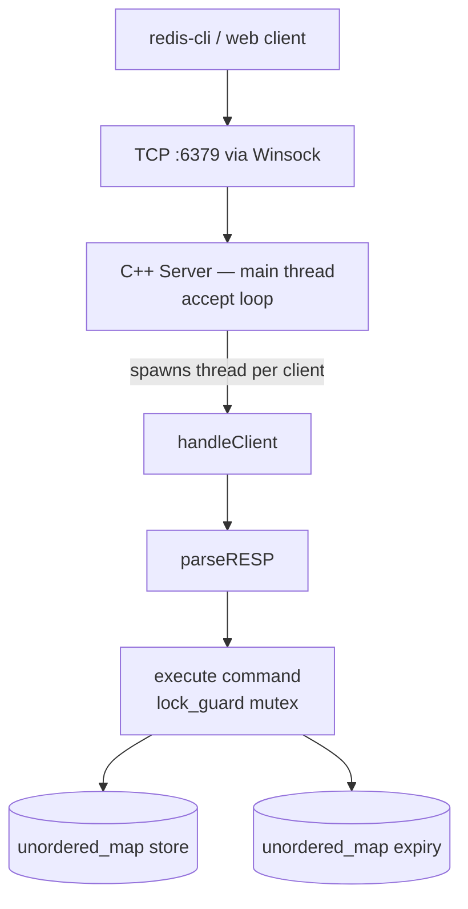
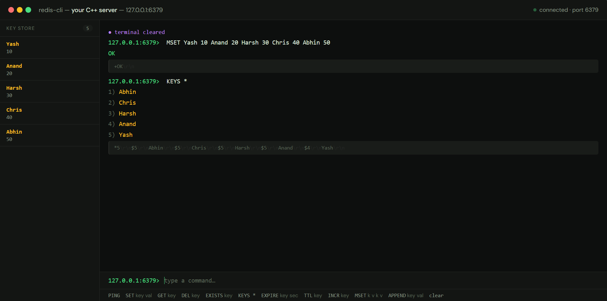
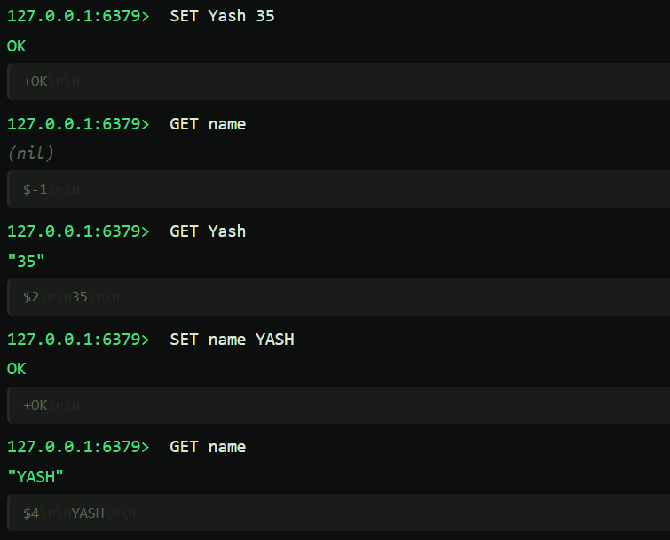

# redis-cpp

A Redis-compatible in-memory key-value server written from scratch in C++, with a live web client that connects to it via WebSockets.

Real Redis clients (`redis-cli`) connect to this server and get back spec-compliant RESP responses — it's not a simulation.



---

## Features

- Full **RESP protocol** parser (Redis Serialization Protocol)
- **Multi-client** support using `std::thread` — each connection gets its own thread with mutex-protected store access
- **Persistence** — store saved to `store.txt` on exit (`SIGINT`/`SIGTERM`), loaded on startup
- **Live web client** — browser terminal that talks to the actual C++ server via a WebSocket bridge

### Commands implemented

| Command | Description |
|---|---|
| `PING` | Returns PONG |
| `SET key value` | Store a key |
| `GET key` | Retrieve a key |
| `DEL key [key...]` | Delete one or more keys |
| `EXISTS key` | Check if key exists |
| `KEYS *` | List all keys |
| `EXPIRE key seconds` | Set TTL on a key |
| `TTL key` | Get remaining TTL (-1 = no expiry, -2 = missing) |
| `INCR key` | Increment integer value |
| `APPEND key value` | Append to existing value |
| `MSET k v [k v...]` | Set multiple keys at once |

---

## Architecture



---

## Running locally

### 1. Compile the server

```bash
g++ redis.cpp -o myredis -lws2_32 -std=c++17
```

### 2. Start the server

```bash
./myredis
# Server listening on port 6379
```

### 3. Test with redis-cli

```bash
redis-cli -p 6379 PING
redis-cli -p 6379 SET name Yash
redis-cli -p 6379 GET name
redis-cli -p 6379 EXPIRE name 10
redis-cli -p 6379 TTL name
```

### 4. Run the web client (optional)

```bash
npm install
node bridge.js        # terminal 2 — WebSocket bridge on :8080
# open index.html in browser
```



---

## Web client

The browser terminal connects to the C++ server via a thin Node.js WebSocket bridge (~30 lines). Every command typed in the browser hits the actual server — the raw RESP bytes are shown alongside each response.



---

## Project structure

```
redis.cpp          — C++ server (Winsock, RESP, threading, persistence)
bridge.js          — Node.js WebSocket → TCP bridge
index.html         — Browser terminal UI
package.json       — Node deps (ws only)
```

---

## Tech

- **C++17** — Winsock2, std::thread, std::mutex, std::unordered_map, std::chrono
- **Node.js** — WebSocket bridge (ws library)
- **Vanilla JS/HTML** — zero-framework browser client
